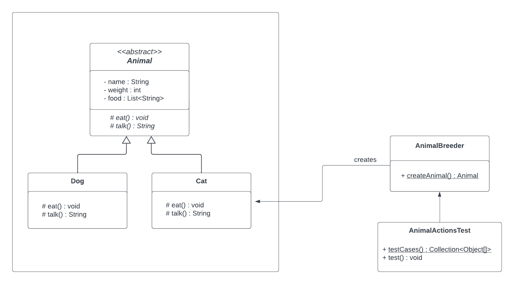

## Question 1 - Software Testing

You are tasked with implementing the factory design pattern to create different types of Animals.

Part 1: You are expected to implement the factory design pattern classes, and <br>
Part 2: You are expected to implement a set of test cases to achieve branch completion using parameterized test cases.


<h3>Part 1: Factory Implementation</h3>

Your implementation must make use of the Factory Method design pattern as described in the UML diagram as follows:

<br>

The UML set out the expected structure of the program as well as the names, attributes, and methods of each class.
Note that for simplicity, constructors and getter/setter methods were not included in the UML.
You are expected to implement public getter/setter methods for all attributes in the `Animal` class.


The Factory class, `AnimalBreeder` takes in parameters required to instantiate Dogs and Cats.
This includes a parameter of type `AnimalType` to determine which class should be created.
For any other inputs that do not specify an AnimalType of Dog or Cat, return null.
The factory method, `createAnimal` must take in the following parameters (in the exact same order):
```createAnimal(AnimalType animalType, String name, int weight, List<String> food)```

The implementations of the methods `eat` and `talk` are as follows
(the access modifier, return type, and annotation of methods are omitted here. Please include them based on the information provided in the UML).

For the Dog class, the methods `eat` and `talk` are:

    eat() {
        for (int i=0; i<this.getFood().size(); i++) {
            String currFood = this.getFood().get(i);
            System.out.println("Eating " + currFood + " ..."); //only prints the first food

            // Gain Weight ...
            if (this.getFood().size() % 2 == 0) {
                this.setWeight(this.getWeight()+3);
            } else {
                this.setWeight(this.getWeight()+1);
            }

            if (i+1==5) break;
        }
        if (this.getFood().size()>0) {
            System.out.println("   __\no-''|\\_____/)\n \\_/|_)     )\n    \\  __  /\n    (_/ (_/    \n");
        }

        // Finished all the food 
        this.setFood(new ArrayList<>());
    }

    talk() {
        return "WOOF!";
    }


For the Cat class, the methods `eat` and `talk` are:

    eat() {
        if (this.getFood().size()>0) {
            this.setWeight(this.getWeight()+1);
            this.setFood(new ArrayList<>(this.getFood().subList(1, this.getFood().size())));

            if ((this.getWeight() + this.getFood().size()) >= 7) {
                System.out.println("MEOWU");
            }
        }
    }

    talk() {
        return "";
    }


<br>
<h3>Part 2: Software Testing</h3>

The second task is to create **Parameterized Tests** in the `AnimalActionTest` class and 
achieve branch complete with the minimal set of test cases 
for the `eat()` method in both `Cat` and `Dog` classes.

You only need to complete the method `testCases()`. Do not make any changes to the other method
and/or the parameters.

*You may want to refer to the lecture slides for software testing, from slide number 60 to 63.*

To achieve branch completeness for loops, you are required (and only required) to test for the following cases:
1. The loop is not executed, and
2. The loop is executed as many times as needed to achieve branch complete.


<br> <br><br>

* * *

#### Important Notes:
Read the specification carefully. Otherwise, you risk receiving zero marks or a certain amount of mark loss.
* Follow the requirements in the **naming and method signatures of classes and methods**, including the CASING of letters.
* Your code must compile successfully to receive marks.
* Your test must be completed within 1000ms.
* You must use JUnit4 to write your test cases.
* All of your test cases must pass the JUnit test.
* The use of libraries is limited to `java.util` and the junit package (`org.junit`). Do not import other libraries.
* We will not test or assess anything printed (from System.out). You do not need to worry about the characters in the provided methods.
* Each invocation of the method counts as a single test case. For example, if the `eat()` method is called twice in a test, the number of test cases performed will increase by 2.

  <br><br>


##### You are expected to upload (and upload only) your answers by pushing your code to the GitLab exam repository
* You must push all classes shown in the UML provided, in the exact names,
* including your test class `AnimalActionTest.java` and other classes, e.g., `Animal.java`
